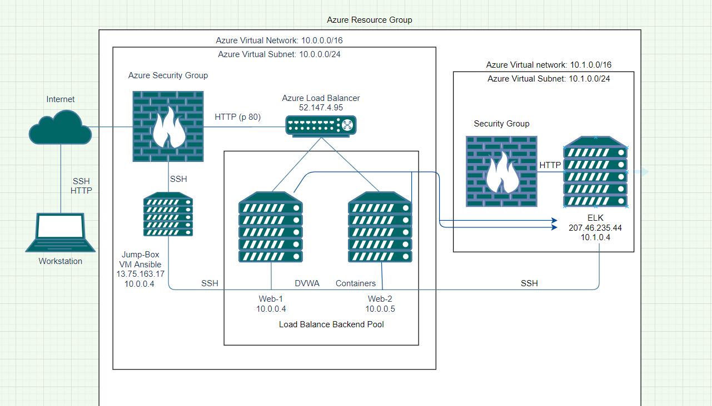
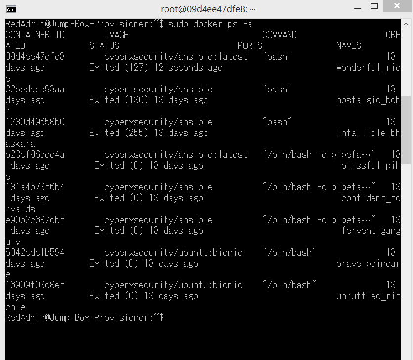

## Automated ELK Stack Deployment

The files in this repository were used to configure the network depicted below.

These files have been tested and used to generate a live ELK deployment on Azure. They can be used to either recreate the entire deployment pictured above. Alternatively, select portions of the __/etc/ansible/roles/install-elk.yml__ file may be used to install only certain pieces of it, such as Filebeat.

This document contains the following details:
- Description of the Topologu
- Access Policies
- ELK Configuration
  - Beats in Use
  - Machines Being Monitored
- How to Use the Ansible Build

### Description of the Topology

The main purpose of this network is to expose a load-balanced and monitored instance of DVWA, the D*mn Vulnerable Web Application.

Load balancing ensures that the application will be highly __effective__, in addition to restricting __traffic__ to the network.
What aspect of security do load balancers protect? What is the advantage of a jump box?_Load balances can prevent DDoS attack by shifting attack traffic. Jump box is a hardened and monitored device that can be used to access and manage devices in a separate security zone

Integrating an ELK server allows users to easily monitor the vulnerable VMs for changes to the __logs__ and system __traffic__.
What does Filebeat watch for?_ Filebeat watches for the log files or locations that you collect log events
What does Metricbeat record?_ It collects metrics from the operating system and from services running on the server.

The configuration details of each machine may be found below.
_Note: Use the [Markdown Table Generator](http://www.tablesgenerator.com/markdown_tables) to add/remove values from the table_.

| Name       | Function | IP Address | Operating System |
|------------|----------|------------|------------------|
| Jump Box   | Gateway  | 10.0.0.4   | Linux            |
| Web-1      | Server   | 10.0.0.5   | Linux            |
| Web-2      | Server   | 10.0.0.6   | Linux            |
| ELK-SERVER | Server   | 10.1.0.4   | Linux            |

### Access Policies

The machines on the internal network are not exposed to the public Internet. 

Only the __home__ machine can accept connections from the Internet. Access to this machine is only allowed from the following IP addresses: 123.208.49.203

Machines within the network can only be accessed by Jump Box Provisioner: IP 10.0.0.4.

A summary of the access policies in place can be found in the table below.

| Name     | Publicly Accessible | Allowed IP Addresses |
|----------|---------------------|----------------------|
| Jump Box | Yes                 | 123.208.49.203       |
| Web-1    | No                  | 10.0.0.4             |
| Web-2    | No                  | 10.0.0.4             |

### Elk Configuration

Ansible was used to automate configuration of the ELK machine. No configuration was performed manually, which is advantageous because it allows IT administrators to automate the tedious tasks from their daily work, such as implementing commands into multiple servers from a single playbook

The playbook implements the following tasks:

- Install: docker.io
- Install: python3-pip
- Install: docker
- Command: sysctl -w vm.max_map_count=262144
- Launch docker container: elk-server

The following screenshot displays the result of running `docker ps` after successfully configuring the ELK instance.

### Target Machines & Beats
This ELK server is configured to monitor the following machines:
Web-1 10.0.0.5 and Web-2 10.0.0.6

We have installed the following Beats on these machines:
filebeat

These Beats allow us to collect the following information from each machine:
`filebeat` collects log files, which we use to examine any changes in the system

### Using the Playbook
In order to use the playbook, you will need to have an Ansible control node already configured. Assuming you have such a control node provisioned: 

SSH into the control node and follow the steps below:
- Copy the __filebeat-config.yml__ file to __/etc/ansible/__.
- Update the __/etc/ansible/hosts__ file to include webserver/elkserver ip addresses
- Run the playbook, and navigate to __http://207.46.235.44:5601/app/kibana#/home__ to check that the installation worked as expected.

_As a **Bonus**, provide the specific commands the user will need to run to download the playbook, update the files, etc._ ansible-playbook my-playbook.yml.
